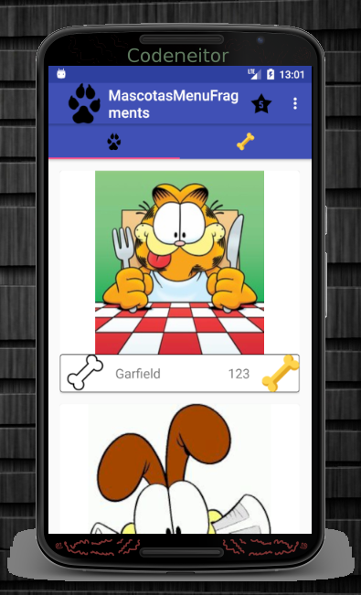
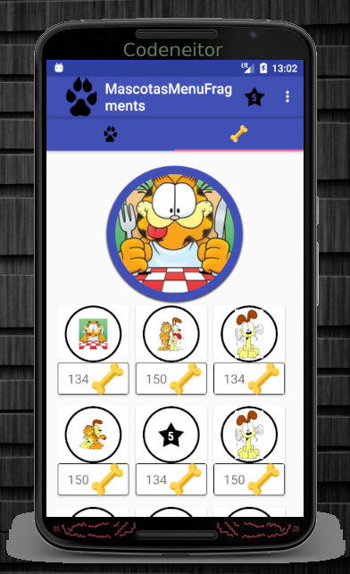
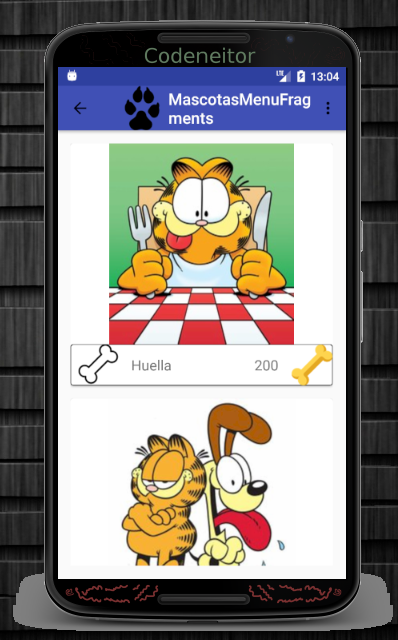
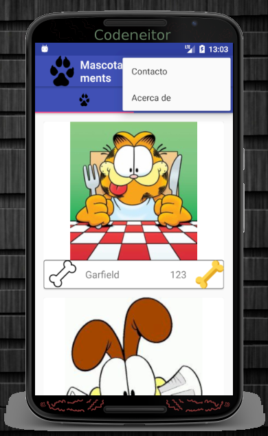
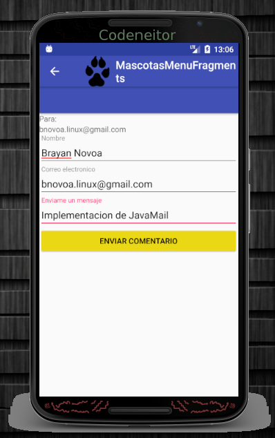
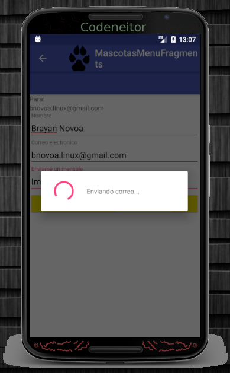
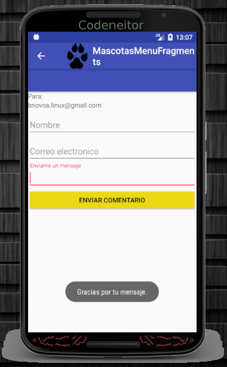
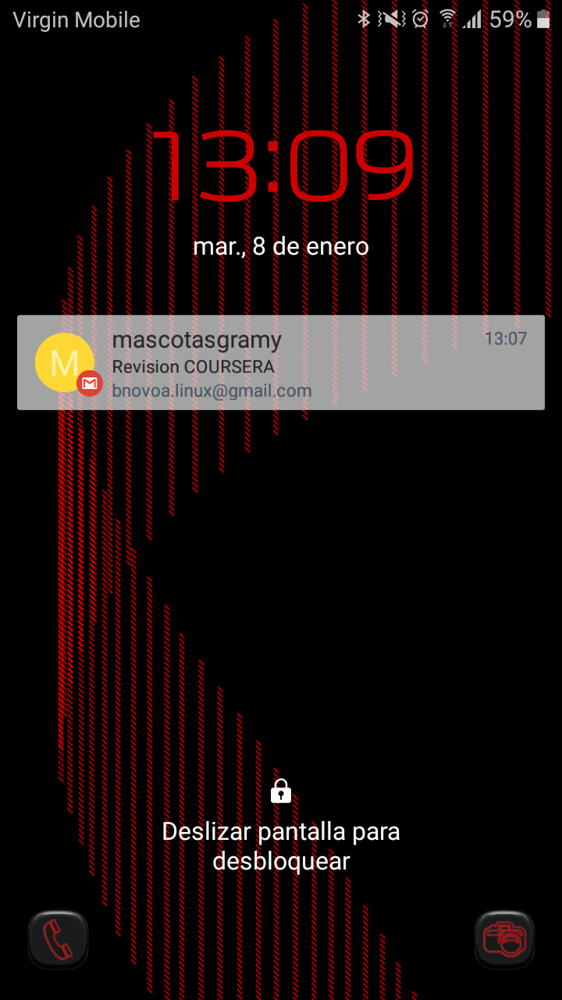

# MascotasMenuFragments
Aplicación de mascotas. Menús y Fragments.

# Trabajo realizado para la semana 4 del curso.

 * Pantalla principal que contiene el ViewPager que maneja los Fragments

 * Pantalla  muestra el PerfilFragment de la mascota

 * Pantalla  muestra las mascotas favoritas

 * Menú de opciones: Contacto y Acerca de
 Se agregan los menús solicitados

* Pantalla de contacto
 se capturan los datos solicitados

 * Se muestra un ProgressDialog que muestra un mensaje Enviando correo.
 progreso de envío del mensaje

* Se muestra un Toast confirmando que el mensaje se ha enviado.
 Mensaje Enviado.

 * Mensaje recibido en un dispositivo físico.
 Confirmación del correo electrónico recibido
